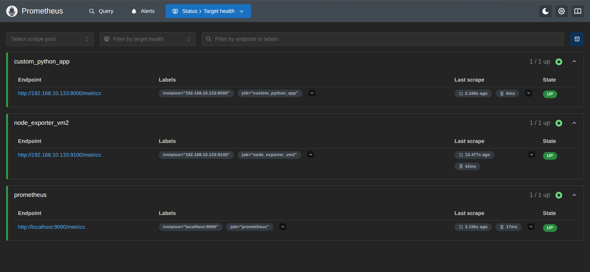

# Enterprise Prometheus Monitoring Lab

This repository contains the deployment procedures and configurations for a production-oriented monitoring environment using Prometheus. It demonstrates how to securely deploy Prometheus, instrument Linux nodes for hardware metrics, and expose custom application metrics using Python.

## Architecture Overview

The lab consists of three core components:
1. **Prometheus Server (VM1):** The central time-series database and scraping engine.
2. **Node Exporter (VM2):** A target node exposing OS and hardware metrics.
3. **Custom Python Application:** A background workload instrumented to expose custom metrics (requests and latency).


---

## Phase 1: Prometheus Server Deployment

Prometheus is configured to run as a dedicated, non-root system user with isolated data directories.

### 1. Preparation
```bash
sudo useradd --no-create-home --shell /bin/false prometheus
sudo mkdir -p /etc/prometheus /var/lib/prometheus
```

### 2. Installation
```bash
# Download and extract Prometheus (v3.12.0)
wget [https://github.com/prometheus/prometheus/releases/download/v3.12.0/prometheus-3.12.0.linux-amd64.tar.gz](https://github.com/prometheus/prometheus/releases/download/v3.12.0/prometheus-3.12.0.linux-amd64.tar.gz)
tar xvfz prometheus-3.12.0.linux-amd64.tar.gz
cd prometheus-3.12.0.linux-amd64

# Move binaries
sudo cp prometheus promtool /usr/local/bin/

# Set ownership
sudo chown prometheus:prometheus /usr/local/bin/prometheus /usr/local/bin/promtool
sudo chown -R prometheus:prometheus /etc/prometheus /var/lib/prometheus
```

### 3. Baseline Configuration (`/etc/prometheus/prometheus.yml`)
```yaml
global:
  scrape_interval: 15s

scrape_configs:
  - job_name: "prometheus"
    static_configs:
      - targets: ["localhost:9090"]

  - job_name: "node_exporter_vm2"
    static_configs:
      - targets: ["<VM2_IP_ADDRESS>:9100"]

  - job_name: "custom_python_app"
    static_configs:
      - targets: ["<PYTHON_APP_IP_ADDRESS>:8000"]
```
*Verify syntax using:* `promtool check config /etc/prometheus/prometheus.yml`

### 4. Systemd Service (`/etc/systemd/system/prometheus.service`)
```ini
[Unit]
Description=Prometheus Monitoring Server
Wants=network-online.target
After=network-online.target

[Service]
User=prometheus
Group=prometheus
Type=simple
ExecStart=/usr/local/bin/prometheus \
    --config.file=/etc/prometheus/prometheus.yml \
    --storage.tsdb.path=/var/lib/prometheus/
Restart=always

[Install]
WantedBy=multi-user.target
```
```bash
sudo systemctl daemon-reload
sudo systemctl enable --now prometheus
```

---

## Phase 2: Node Exporter Deployment (Target Node)

Node Exporter translates local hardware and OS metrics into a Prometheus-readable format.

### 1. Installation
```bash
sudo useradd --no-create-home --shell /bin/false node_exporter
wget [https://github.com/prometheus/node_exporter/releases/download/v1.11.1/node_exporter-1.11.1.linux-amd64.tar.gz](https://github.com/prometheus/node_exporter/releases/download/v1.11.1/node_exporter-1.11.1.linux-amd64.tar.gz)
tar xvfz node_exporter-1.11.1.linux-amd64.tar.gz
sudo cp node_exporter-1.11.1.linux-amd64/node_exporter /usr/local/bin/
sudo chown node_exporter:node_exporter /usr/local/bin/node_exporter
```

### 2. Systemd Service (`/etc/systemd/system/node_exporter.service`)
```ini
[Unit]
Description=Prometheus Node Exporter
Wants=network-online.target
After=network-online.target

[Service]
User=node_exporter
Group=node_exporter
Type=simple
ExecStart=/usr/local/bin/node_exporter
Restart=always

[Install]
WantedBy=multi-user.target
```
```bash
sudo systemctl daemon-reload
sudo systemctl enable --now node_exporter
```
*(Ensure firewall permits TCP port 9100)*

---

## Phase 3: Python Application Instrumentation

A custom Python application generating system metrics via the `prometheus_client` library.

### 1. Environment Setup
```bash
sudo mkdir -p /opt/custom_python_app
sudo chown $USER:$USER /opt/custom_python_app
cd /opt/custom_python_app
python3 -m venv venv
source venv/bin/activate
pip install prometheus-client
```

### 2. Application Code (`app.py`)
```python
from prometheus_client import start_http_server, Counter, Histogram
import time
import random

# Define core metrics
REQUESTS = Counter('app_tasks_total', 'Total number of background tasks processed')
LATENCY = Histogram('app_task_latency_seconds', 'Latency of tasks in seconds')

def process_workload():
    """Simulate a production workload"""
    REQUESTS.inc()
    with LATENCY.time():
        time.sleep(random.uniform(0.1, 0.7))

if __name__ == '__main__':
    # Bind to 0.0.0.0 to allow external scraping
    start_http_server(8000, addr='0.0.0.0')
    print("Python metrics endpoint listening on 0.0.0.0:8000...")
    
    while True:
        process_workload()
```

### 3. Systemd Service (`/etc/systemd/system/python_metrics_app.service`)
```ini
[Unit]
Description=Prometheus Instrumented Python Application
Wants=network-online.target
After=network-online.target

[Service]
User=root 
WorkingDirectory=/opt/custom_python_app
ExecStart=/opt/custom_python_app/venv/bin/python /opt/custom_python_app/app.py
Restart=always
RestartSec=5

[Install]
WantedBy=multi-user.target
```
```bash
sudo systemctl daemon-reload
sudo systemctl enable --now python_metrics_app.service
```
*(Ensure firewall permits TCP port 8000)*

---

## Useful PromQL Queries

**RAM Usage Percentage:**
```promql
((node_memory_MemTotal_bytes - node_memory_MemAvailable_bytes) / node_memory_MemTotal_bytes) * 100
```

**Custom App Total Requests:**
```promql
app_tasks_total
```